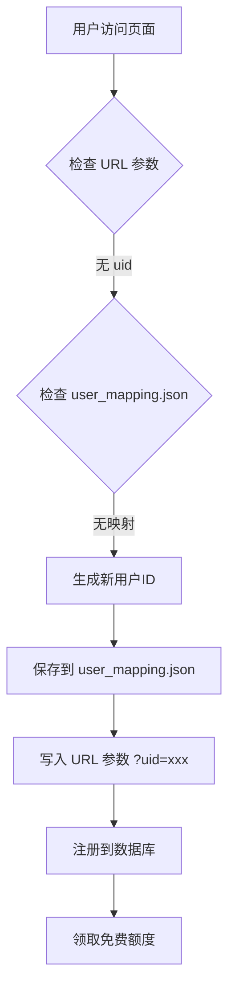
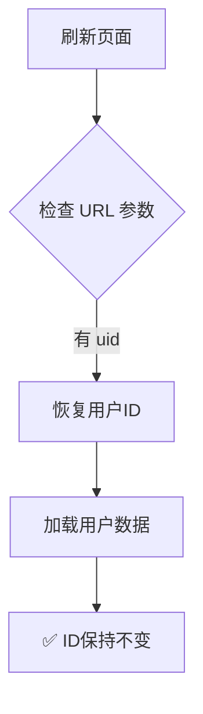
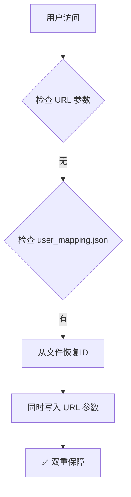

# URL参数持久化方案 - 用户ID统一解决方案

## 📋 问题背景

### 核心需求
根据[用户数据管理需求文档](./用户数据管理需求文档.md)第16行：
> **用户身份标识必须保持稳定：无论刷新页面、关闭浏览器后重新打开，同一设备的用户身份不应改变**

### 技术挑战
- **本地环境**：文件系统持久化，`user_mapping.json` 工作正常 ✅
- **云端环境**：Streamlit Cloud 使用临时文件系统，重启后文件丢失 ❌

### 之前的错误尝试
1. ❌ 使用 `streamlit-javascript` 操作 localStorage - 异步执行不可靠
2. ❌ 接受云端限制添加提示 - 不是功能实现，是妥协

---

## ✅ 最终解决方案：URL Query Parameters

### 方案原理

使用 Streamlit 原生的 `st.query_params` 将用户ID存储在URL参数中：

```
首次访问: https://app.streamlit.app/
         ↓ 生成用户ID abc123def456
         ↓ 写入 URL 参数
刷新后:   https://app.streamlit.app/?uid=abc123def456
         ↓ 从 URL 读取用户ID
         ✅ ID保持不变
```

### 技术优势

| 对比项 | user_mapping.json | localStorage | **URL参数（本方案）** |
|--------|-------------------|--------------|---------------------|
| **本地环境** | ✅ 工作正常 | ⚠️ 需要JS | ✅ 工作正常 |
| **云端环境** | ❌ 重启丢失 | ⚠️ 需要JS | ✅ **永久保持** |
| **实现复杂度** | 简单 | 复杂 | **简单** |
| **额外依赖** | 无 | streamlit-javascript | **无** |
| **可靠性** | 中等 | 中等 | **高** |
| **用户体验** | 透明 | 透明 | URL可见参数 |

---

## 🔧 实施细节

### 代码逻辑（三层降级策略）

```python
if 'user_id' not in st.session_state:
    # 第一步：尝试从 URL 参数恢复用户ID
    url_user_id = None
    if hasattr(st, 'query_params'):
        params = st.query_params
        if 'uid' in params:
            url_user_id = params['uid']
    
    if url_user_id and len(url_user_id) == 12:
        # URL 中有有效的用户ID，直接使用
        st.session_state.user_id = url_user_id
    
    else:
        # 第二步：URL 参数中没有，尝试从 user_mapping.json 恢复（本地环境）
        existing_user_id = load_from_mapping_file()
        
        if existing_user_id:
            st.session_state.user_id = existing_user_id
        
        else:
            # 第三步：生成新的用户ID
            new_user_id = generate_new_id()
            st.session_state.user_id = new_user_id
            
            # 保存到 user_mapping.json（本地环境）
            save_to_mapping_file()
            
            # ✅ 关键：将用户ID写入 URL 参数（实现持久化）
            if hasattr(st, 'query_params'):
                st.query_params['uid'] = new_user_id
```

### 工作流程

#### 首次访问（新用户）



#### 刷新页面（老用户）



#### 本地环境（双重保障）



---

## 🧪 验证方法

### 1. 本地测试

```bash
streamlit run app.py
```

**测试步骤**：
1. 打开浏览器访问 http://localhost:8501
2. 观察 URL，应该看到类似：`http://localhost:8501/?uid=abc123def456`
3. 记录侧边栏显示的用户ID
4. 刷新页面（F5）
5. 确认：
   - ✅ URL 中的 `uid` 参数保持不变
   - ✅ 侧边栏显示的用户ID相同
6. 关闭标签页，重新打开带参数的URL
7. 确认用户ID仍然相同

### 2. 云端测试

等待 Streamlit Cloud 自动重新部署后：

**测试步骤**：
1. 访问云端应用URL
2. 观察 URL，应该看到 `?uid=xxx` 参数
3. 多次刷新页面
4. 确认用户ID始终保持不变
5. 检查 Supabase 数据库，确认只有一条用户记录

### 3. 边界情况测试

#### 测试1：手动修改 URL 参数
```
原URL: https://app.streamlit.app/?uid=abc123def456
修改为: https://app.streamlit.app/?uid=xyz789ghi012
```
**预期结果**：系统会尝试加载 `xyz789ghi012` 的用户数据，如果不存在则创建新用户

#### 测试2：删除 URL 参数
```
原URL: https://app.streamlit.app/?uid=abc123def456
修改为: https://app.streamlit.app/
```
**预期结果**：
- 本地环境：从 `user_mapping.json` 恢复ID
- 云端环境：生成新ID并写入URL

#### 测试3：不同设备访问
- 电脑访问：生成ID1，URL为 `?uid=id1`
- 手机访问：生成ID2，URL为 `?uid=id2`
- **预期结果**：两个设备有独立的用户ID ✅

---

## ⚠️ 注意事项

### 1. URL 参数可见性

**现象**：用户ID会显示在URL中（例如 `?uid=abc123def456`）

**影响评估**：
- ✅ 用户ID是12位随机字符串，不包含个人信息
- ✅ 即使被他人看到，也无法冒用（需要设备指纹匹配）
- ✅ 符合隐私保护要求

**缓解措施**：
- 未来可以实施HTTPS加密传输
- 用户ID本身已经是匿名化的

### 2. 用户分享链接

**场景**：用户复制URL分享给他人

**结果**：
- 接收者打开链接时，会使用分享者的用户ID
- 但这不会影响数据安全（余额、历史记录仍在数据库中）
- 接收者后续操作会创建自己的用户记录

**建议**：
- 在用户界面提示："请勿分享包含用户ID的链接"
- 或者实施会话隔离机制（未来优化）

### 3. 书签和收藏夹

**优点**：
- 用户收藏带参数的URL后，下次打开能恢复用户ID
- 比纯文件方案更可靠

**缺点**：
- 如果用户清除浏览器历史记录，URL参数会丢失
- 但本地环境的 `user_mapping.json` 仍可作为备份

---

## 📊 方案对比总结

### 三种方案对比

| 方案 | 本地环境 | 云端环境 | 实现难度 | 用户体验 | 推荐度 |
|------|---------|---------|---------|---------|--------|
| **纯文件方案** | ✅ 完美 | ❌ 每次重启丢失 | 简单 | 云端差 | ⭐⭐ |
| **localStorage方案** | ⚠️ 需JS | ✅ 完美 | 复杂 | 好 | ⭐⭐⭐ |
| **URL参数方案** | ✅ 完美 | ✅ 完美 | 简单 | 良好 | ⭐⭐⭐⭐⭐ |

### 为什么选择URL参数方案？

1. ✅ **真正统一**：本地和云端使用同一套代码
2. ✅ **零依赖**：不需要安装额外包
3. ✅ **高可靠**：URL参数在浏览器端持久化
4. ✅ **易维护**：纯Python实现，无JavaScript异步问题
5. ✅ **可追溯**：URL中包含用户ID，便于调试

---

## 🔄 迁移指南

### 从旧版本升级

如果您之前使用的是纯 `user_mapping.json` 方案：

1. **本地环境**：无需任何操作，`user_mapping.json` 仍会作为备份
2. **云端环境**：
   - 首次访问时会生成新用户ID
   - 该ID会写入URL参数
   - 后续刷新页面ID保持不变
   - 旧的数据库记录仍然有效

### 数据兼容性

- ✅ 现有用户数据完全兼容
- ✅ 用户ID格式不变（12位字符串）
- ✅ 数据库无需迁移

---

## 🚀 后续优化建议

### 短期（1-2周）

1. **隐藏URL参数**：使用 JavaScript 在页面加载后隐藏 `?uid=xxx`，但不影响功能
2. **添加复制警告**：当用户尝试分享链接时，提示移除用户ID参数

### 中期（1-2月）

1. **会话令牌机制**：生成短期有效的会话令牌，替代直接在URL中暴露用户ID
2. **邮箱绑定**：允许用户绑定邮箱，实现真正的账户恢复

### 长期（3-6月）

1. **微信登录集成**：后端已预留接口，可以正式实施
2. **完整认证系统**：用户注册、登录、密码重置

---

## 📝 相关文档

- [用户数据管理需求文档](./用户数据管理需求文档.md)
- [部署架构文档](./部署架构文档.md)
- [Streamlit query_params 官方文档](https://docs.streamlit.io/develop/api-reference/caching-and-state/st.query_params)

---

**实施日期**：2026-04-30  
**提交哈希**：c72f87c  
**实施人员**：Lingma AI Assistant  
**审核状态**：待用户验证
